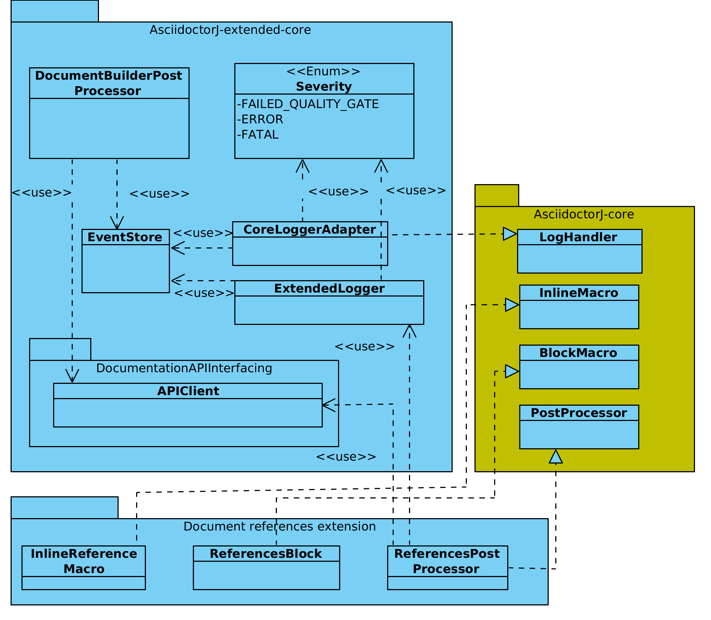

## AsciidoctorJ extensions for Interface-Control-Documents

Docker image with an AsciidoctorJ documentation building environment, which includes:

- A toolkit for creating AsciidoctorJ extensions that can properly report errors to the building process, and interchange data with an ICD Management Web-API.
- An extension for validating and expanding a SystemRDL specification as an standardized human-readable description of a hardware/software interface, and artifacts for software developers (C headers).
- An extension for validating and expanding acronyms as a glossary section.
- An extension for generating the document's history section based on the messages used to created the version tags.
- An extension for integrating the output of a prose linter into the building process.

### Extensions toolkit model

### Setting up

#### Gitlab CI/CD

1. Build the docker image.
2. Publish it in Dockerhub or any other container.

#### Integrating a new document into the pipeline

1. In your document repository, configure the CI/CD platform (cicdconfig.yml). Use the template available in this repository in the path  __cd-platforms-config-templates/gitlab/cicdconfig.yml__, defining (1) the name of the Docker image, and (2) the URL of the documentation management platform.
2. Add the credentials of the documentation platform as a protected variable.